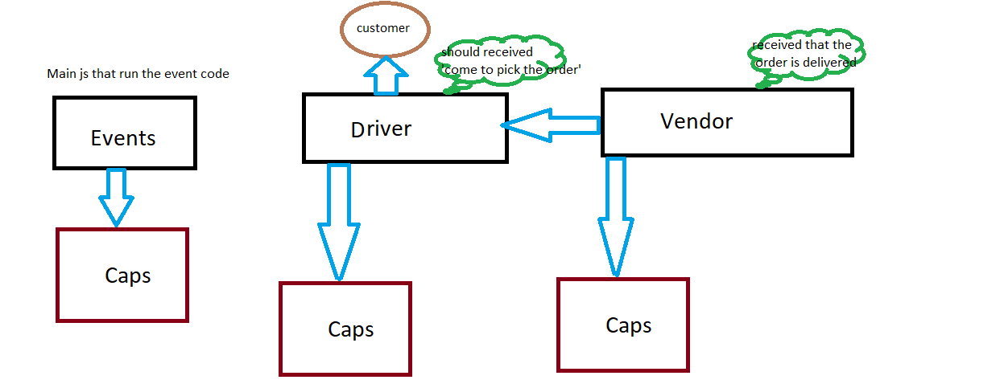
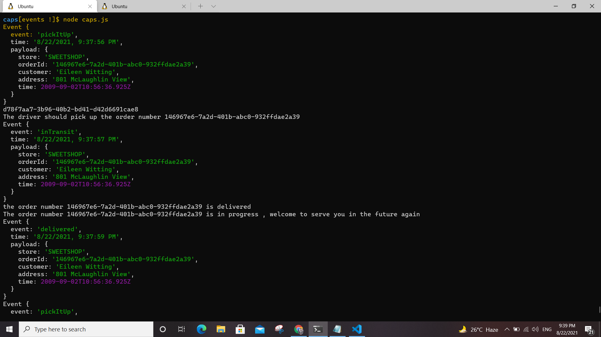
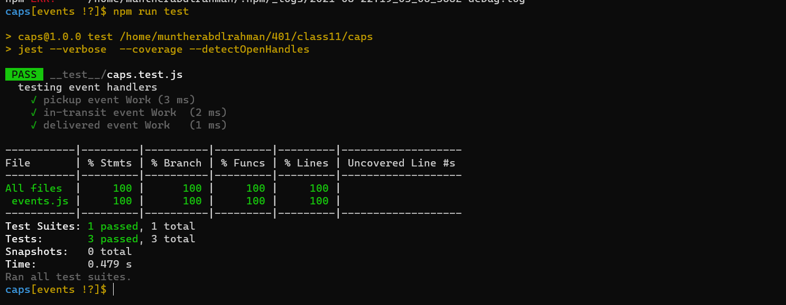
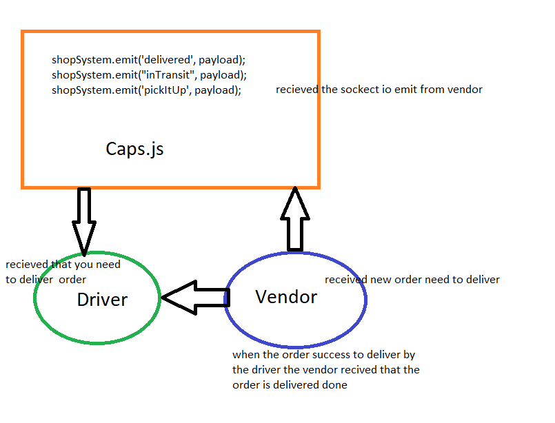
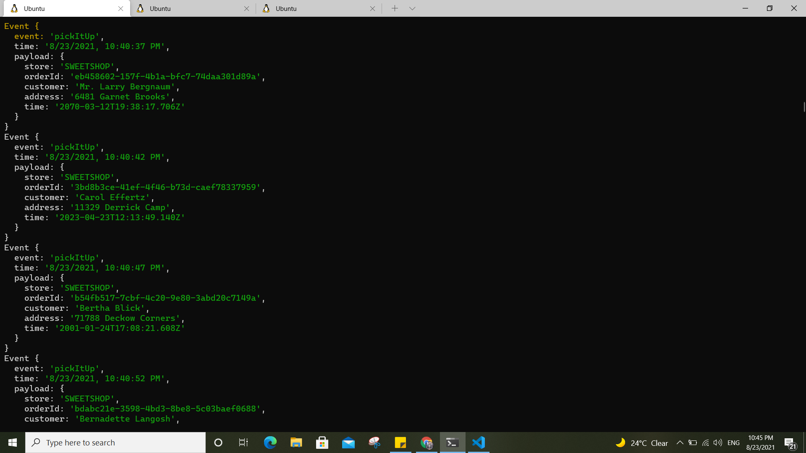
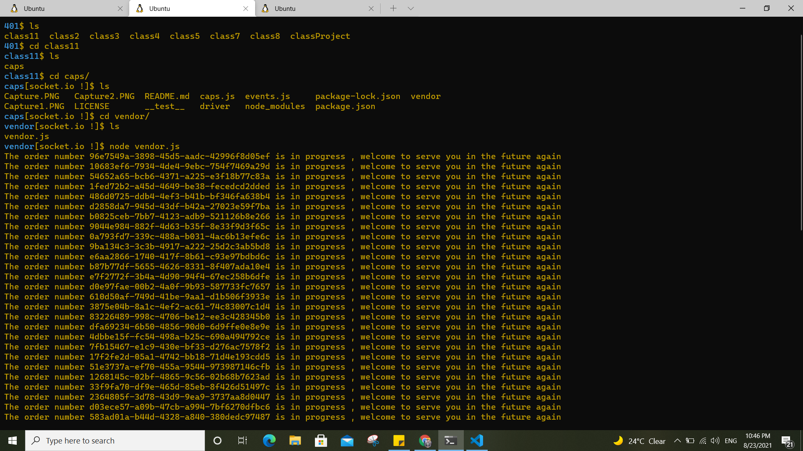
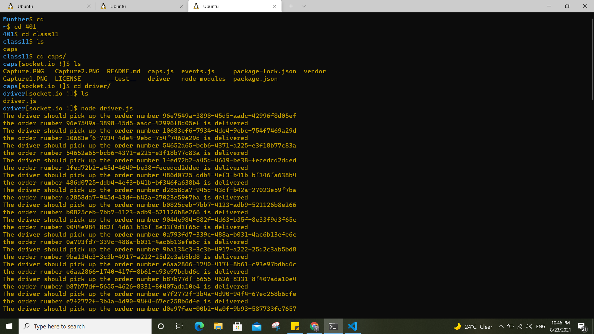
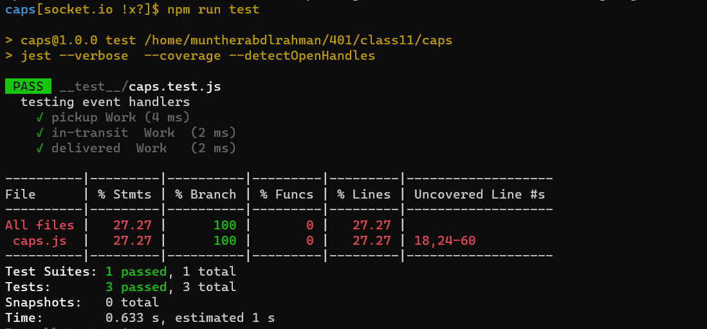
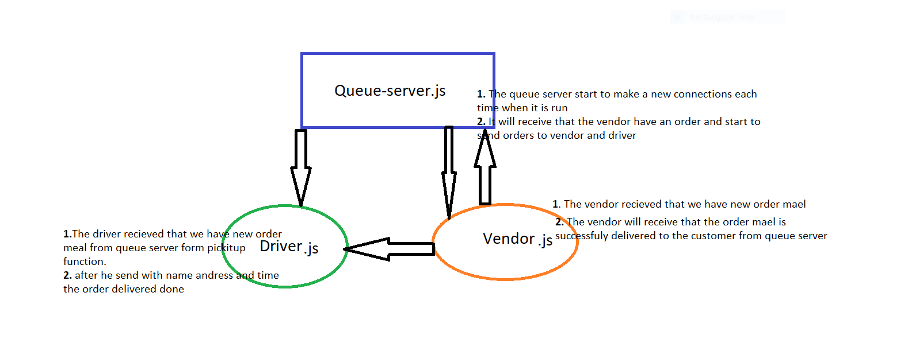
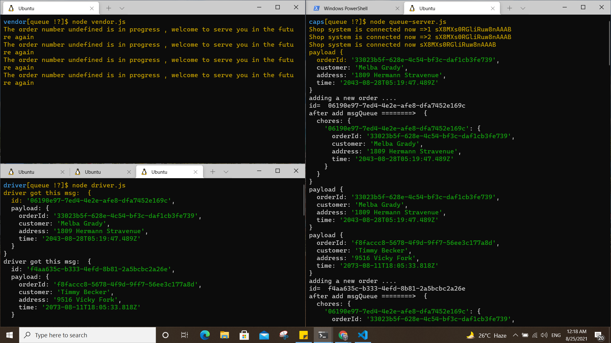

# caps

# class 11
## UML :

## env : SHOP_NAME=SWEETSHOP
##         shop_ID=1234

## console output :

## Tests :
## npm run test

----------------------------------------------------------------------------------------------------

# class 12
## UML :

## env : SHOP_NAME=SWEETSHOP
##         shop_ID=1234

## console output :

## Tests :
## npm run test

------------------------------------------------------------------------------------------------------------------------------------------------------------------------------------------------------------------------------------------------------------------------------------------------

# class 12
## UML :

## env : SHOP_NAME=SWEETSHOP
##         shop_ID=1234

## console output :

